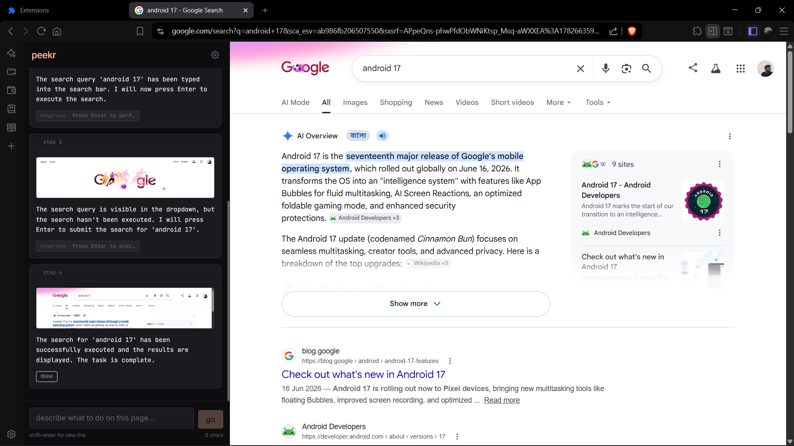

# Peekr Browser Assistant

AI-powered browser automation using free vision models. Just tell Peekr what to do in plain English, and it will browse the web for you—clicking, typing, and scrolling automatically.



## Getting Started

### Prerequisites
- Node.js 18+
- Chrome or a Chromium-based browser
- A free OpenRouter account

### Install & Build
```bash
git clone https://github.com/anonically22/peekr.git
cd peekr
npm install
npm run generate-icons
npm run build
```

### Load the Extension
1. Open `chrome://extensions` in your browser.
2. Turn on **Developer mode** (top right corner).
3. Click **Load unpacked** and select the `dist/` folder inside the peekr directory.
4. Click the Peekr icon in your toolbar to open the side panel.

### Configure
Open the Settings (gear icon) inside the Peekr panel to:
- Add your OpenRouter API key.
- Select your preferred vision model.
- Add your profile details so Peekr can fill out forms for you.
- Adjust speed and rate limit settings.

## Usage
1. Go to any website.
2. Type a task, like "Find the best coffee shops near me."
3. Click **Go**. Peekr will look at your screen, decide what to do, and start acting.
4. You can watch Peekr think and see what it's looking at in the side panel.
5. Click **Stop** anytime to cancel the task.

## Development
```bash
npm run dev    # Watch mode: auto-rebuilds the UI when you save files
npm run build  # Production build
```
*Note: If you change background scripts, go to `chrome://extensions` and click the refresh button on the Peekr extension to reload it.*

## Architecture
```text
User prompt → Screenshot (1280x800) → AI Vision Model → Parse actions
                                                           ↓
                               Execute via Chrome Debugger API
                                                           ↓
                                     New screenshot → Loop until done
```

- **Side Panel (React + Zustand):** The chat interface showing thoughts and actions.
- **Service Worker:** Runs the main loop and talks to the AI in the background.
- **Screenshot Service:** Takes screenshots and resizes them perfectly for the AI.
- **Debugger API:** Actually does the clicking, typing, and scrolling.

## Project Structure
```text
src/
├── background/
│   └── service-worker.js         # Handles the main agent loop
├── services/
│   └── screenshotService.js      # Takes and resizes screenshots
├── sidepanel/
│   ├── main.jsx                  # React entry point
│   ├── App.jsx                   # Main layout
│   ├── store/
│   │   └── agentStore.js         # State management
│   ├── hooks/
│   │   └── useSettings.js        # Saves user settings
│   └── components/               # UI parts (Header, Input, Cards)
└── index.css                     # Styles
```


